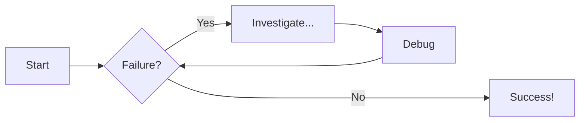

# **Starting with MkDocs - Love at first use**

**Date:** March 8, 2025    
**Author:** sam-i-am

<pre style="color: #3f51b5; font-size: 1.1rem;"><code>"Hello World! 🌐"</code></pre>
---

I am sitting here in the St Agnus NYPL Library, where I spent a lot of the past week, writing code.  This has been an incredible journey.  It was only 6 days ago, that I took the time to try and understand how to use Cursor, the VSCode AI developer IDE.  [With Cursor] I have written about 3000 lines of working code, developing the pipeline for Nanobot.  

I now need to start with documentation, and I chose to start with MkDocs, and it is rather nice!  

## **Project documentation with Markdown**  

---

### What it Does

You can find it at [MkDocs Pages](https://www.mkdocs.org/), and the Github repo is at [Github MkDocs](https://github.com/mkdocs)

The key is that you can do all of the documentation in markdown, which makes understanding and updating easy.  It also gives you a very nice web interface, serving a site and can also deploy to github.io to make the docs part of your repo.  Mindblowing 🤯.

### Choosing Your Theme

The first thing to do is to choose your theme.  There are two built-in themes:
* [mkdocs](https://www.mkdocs.org/user-guide/choosing-your-theme/#mkdocs)
* [readthedocs](https://www.mkdocs.org/user-guide/choosing-your-theme/#readthedocs)

There are also many third part themes, which you are advised to use at your own risk.  However, there is another which is highly used and well suported and documented, which has 22k stars and is written by squidfunk:

* [material](https://squidfunk.github.io/mkdocs-material/getting-started/)

This is what I have decided to use

### Choosing Your Plugins

Plugins are sometimes third party items.  Be careful.  I tried the mkdocs-video and it did weird stuff and I uninstalled it.  In any event there is a list of Themes and Plugins at the [MkDocs Catalog](https://github.com/mkdocs/catalog) in the README.  


### How to install it

There were only 3 pip installs that I had to do.  the `mkdocstrings[python]` will evidently read your docstrings and create the API docs from them, but I have not used this feature yet so will update when I get there.  

```bash
# Core MkDocs package
pip install mkdocs

# Material theme for MkDocs
pip install mkdocs-material

# MkDocstrings for API documentation from docstrings
pip install mkdocstrings[python]
```
#### YML File Structure
You will also need a YML file with the configuration `mkdocs.yml`.
My current YAML file looks like:

```YAML
site_name: NanoBot Documentation 🤖
site_description: Documentation for the NanoBot POC project
site_author: Your Name

# Standard docs directory
docs_dir: docs

theme:
  name: material
  palette:
    # Light mode
    - media: "(prefers-color-scheme: light)"
      scheme: default
      primary: indigo
      accent: indigo
      toggle:
        icon: material/brightness-7
        name: Switch to dark mode
    
    # Dark mode
    - media: "(prefers-color-scheme: dark)"
      scheme: slate
      primary: indigo
      accent: indigo
      toggle:
        icon: material/brightness-4
        name: Switch to light mode
  features:
    - navigation.tabs
    - navigation.sections
    - navigation.expand
    - navigation.instant
    - toc.integrate
    - search.suggest
    - search.highlight

markdown_extensions:
  - pymdownx.highlight
  - pymdownx.superfences
  - pymdownx.tabbed
  - pymdownx.tasklist
  - admonition
  - toc:
      permalink: true
  - pymdownx.emoji:
      emoji_index: !!python/name:material.extensions.emoji.twemoji
      emoji_generator: !!python/name:material.extensions.emoji.to_svg
  - md_in_html

plugins:
  - search
  - mkdocstrings:
      handlers:
        python:
          selection:
            docstring_style: google
          rendering:
            show_source: true
            show_root_heading: true

nav:
  - Home: index.md
  - Getting Started: getting-started.md
  - User Guide:
    - Overview: user-guide/index.md
    - Document Processing: user-guide/document-processing.md
    - Vector Search: user-guide/vector-search.md
  - API Reference:
    - Database: api/database.md
    - Services: api/services.md
  - Examples: examples.md
  - Blog: 
    - Overview: blog/index.md
    - MkDocs: blog/mkdocs-2025-03-08.md
```
#### docs File structure (Holds all of your Markdown files)
This is my current dir structure.  I place the `/docs` directory in the root of my nanobot-poc project.  
> NOTE: The `index.md` files are necessary

```bash
docs/
├── api/
│   ├── database.md
│   └── services.md
├── blog/
│   ├── post-2025-03-08.md
│   └── index.md
├── img/
│   ├── nanobot_schema.jpg
├── user-guide/
│   ├── document-processing.md
│   ├── index.md
│   └── vector-search.md
├── examples.md
├── getting-started.md
└── index.md
```
### How to use it

I havent worked with this but more than 1 hour now, but here is what I know:

You can serve the pages locally by running the following command from the root
```bash 
mkdocs serve
```
This will launch a local server on port 8000 `http://127.0.0.1:8000/` where you interact with the HTML version of it.  It is evidently a Bootstrap implementation.  

> NOTE: If you change the YML file you will need to stop the server `ctl C` and then restart it again by `mkdocs serve`

You can add documents to this but to get them seem in the navigation sidebar you need to add them to the YML file.  If you know the file name you can still navigate to it using the URL but you will not see it in the `nav` sidebar.  

You can deploy this to github.  In the case of my own repo of `nanobot-poc` I would navigate to `srobertsphd.github.io/nanobot-poc` and this is where it would reside.  There is an order of events though. 

#### Updating GitHub repo

1. Update your Markdown Docs
2. Update you `mkdocs.yml` file to unclude any new docs
3. Navigate to your project directory
4. Push the updated mkdown to the repo
```bash
git add docs/ mkdocs.yml
git commit -m "updated documentation"
git push
```
5. Deploy to GitHub Pages using MkDocs  

```bash
  mkdocs gh-deploy
```
> #### Important Notes
> * If your repository is private, you'll need a GitHub Pro, Team, or Enterprise account to use GitHub Pages  
> * It may take a few minutes for your site to be available after deployment  
> * You can check the status of your GitHub Pages deployment in your repository settings

### Content tabs

The indenting here really matters -- needs to be double tabbed

this is the markdown for the three tabs below

```markdown
=== "plain Text"

    This is some plain text with code

    ```python
    print("hello world")
    ```

=== "Unordered List"

    * first
    * second
    * third

=== "Ordered List"

    1. first
    2. second
    3. third
```

And this renders as the three tabs below

=== "plain Text"

    This is some plain text with code

    ```python
    print("hello world")
    ```

=== "Unordered List"

    * first
    * second
    * third

=== "Ordered List"

    1. first
    2. second
    3. third


### Admonishions

Examople of an admonition/callout with a title:

Note the types here -- there is also
* note
* info
* success
* tip

Each have their own icons.  check it out!

!!! note "Title of the Callout"

    this is some text that is indented with 2 tabs.  here is some more text.  also i wanted to say hello world.  this is an amazing place to be these days


??? info "Title of the COLLAPSIBLE Callout [CLICK on me]"

    this is some text that is indented with 2 tabs.  here is some more text.  also i wanted to say hello world.  this is an amazing place to be these days

### Diagram Examples

#### Flowcharts



## Adding MathJax for Equation formatting and Display

Taken from the documents -- you will need to add a javascripts folder with the following code, and also modify the mkdocs.yml file as below:

=== "docs/javascript/mathjax.js"

    ```javascript
    window.MathJax = {
      tex: {
        inlineMath: [["\\(", "\\)"]],
        displayMath: [["\\[", "\\]"]],
        processEscapes: true,
        processEnvironments: true
      },
      options: {
        ignoreHtmlClass: ".*|",
        processHtmlClass: "arithmatex"
      }
    };

    document$.subscribe(() => { 
      MathJax.startup.output.clearCache()
      MathJax.typesetClear()
      MathJax.texReset()
      MathJax.typesetPromise()
    })
    ```

=== "mkdocs.yml"

    ```yaml
    markdown_extensions:
      - pymdownx.arithmatex:
          generic: true

    extra_javascript:
      - javascripts/mathjax.js
      - https://unpkg.com/mathjax@3/es5/tex-mml-chtml.js
    ```


## Closing Comments

Writing code is so much fun. Learning new libraries in minutes is amazing fun[^1]. Leaning how to document things and start writing in less than an hour and having it look good and be accessible --> INCREDIBLE good feeling[^2].

This is a pretty sweet gig.  

### References

[^1]: James Willet Dev [Full Tutorial To Build And Deploy Your Docs Portal](https://www.youtube.com/watch?v=xlABhbnNrfI)  https://www.youtube.com/watch?v=xlABhbnNrfI
[^2]: James Willet Dev [Getting Started with Material for MkDocs](https://jameswillett.dev/getting-started-with-material-for-mkdocs/) -- _https://jameswillett.dev/getting-started-with-material-for-mkdocs/_

