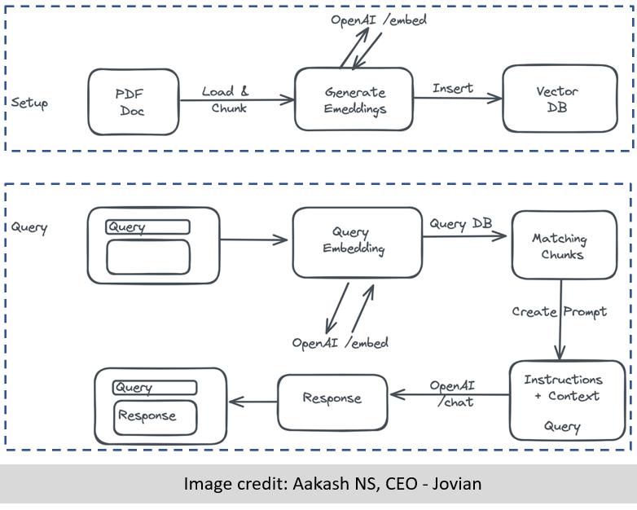

# NanoBot-Dev Documentation 🤖

Welcome to the NanoBot-Dev documentation. This site provides comprehensive information about using and extending the NanoBot development pipeline.

## What is NanoBot?

NanoBot is a document processing and retrieval system with vector search capabilities. It allows you to:

- Process documents (PDF, DOCX, TXT, Google Sheets etc)
- Chunk documents into manageable pieces
- Generate vector embeddings
- Store the document data and text in a relational database
- Search documents via a simple chatbot interface

## Purpose of this development codebase

We are developing a codebase that creates an intuitive pipeline that can be easily followed, understood and modified by all members involved in the development. The Dev component is a robust pipeline that can empower people and organizations to generate their very own Bot with their own documentation, enabling them to also demonstrate and understand the power and potential of GenAI in their own labs, facilities and research.

This project presumes that an out-of-the-box chatbot developed using many online WYSIWYG frameworks is great for concept, but often fails on utility. By introducing and teaching these concepts in a python codebase framework, we open up the power of Generative AI with only a few customizations.  

It is our hope by doing so, that we not only create a cohesive codebase with functional code for our respective facilities, but that we are able to bring new members on board to help them employ instances of this codebase at their own locations. This building of code simultaneously builds community and further collaboration — this is $\mathbf{C}^3$

## Quick Navigation

- [Getting Started](getting-started.md) - Installation and basic setup
- [User Guide](user-guide/00-index-user-guide.md) - Detailed usage instructions
- [API Reference](api/database.md) - Technical reference for developers
- [Examples](examples.md) - Code examples and tutorials

