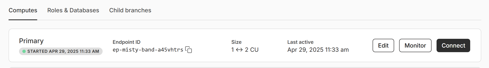

# Configuring Neon [(Neon.tech)](https://neon.tech)

## Account 

You will need to set up an account.  There is a free tier which will be fine to get you started. You will need to verify the email address that you are using.  

## Project

After verifying your email information, you will need to create a project.  

* Below is a screenshot where I have created a nanobot-dev project.
* You will pick a location that is near the area that this data will serve.    

## Database

You will see that your default database name is neondb.  This is fine to keep for now.  

## Branches

Both production and development braches are made.  Note that the development branch is a child of the main production branch.  The Default branch is the `production` branch.  

## Connecting to the database (URL)

Clicking on the production branch will bring up the following screen

You then want to click onn the `Connect` button on the far right which will open a screen that looks like the one below:

Copy the connection string.  This is the `NEON_URL` that you will need in your `.env` file to connect to the database

